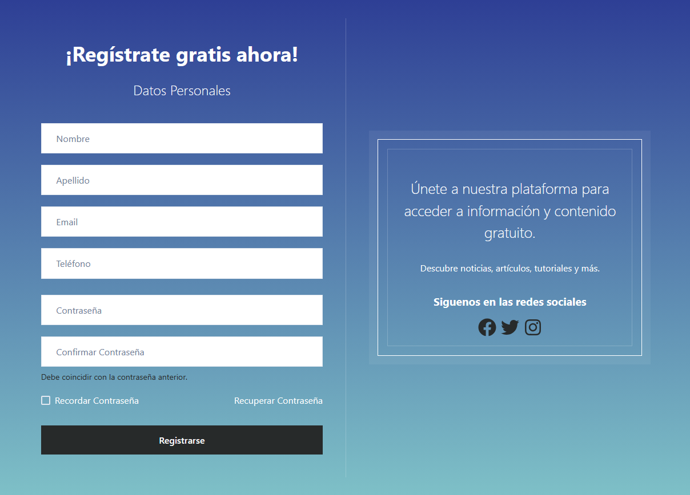

# Proyecto de Registro de Página Web

Este proyecto fue desarrollado como parte de una ejercitación en un curso de React. El objetivo principal fue practicar la creación de un formulario de registro en una página web utilizando React JS y JSX.

El enfoque principal de esta ejercitación fue el maquetado y la utilización de componentes en React para estructurar la interfaz de usuario del formulario de registro. No se implementó lógica de validación ni se guardaron los usuarios.

## Captura de Pantalla

## Características
- Barra de Navegación: Incluye enlaces para las secciones principales de la aplicación, con estilos de Chakra UI para una apariencia moderna y responsive.

- Formulario de Registro: Un formulario interactivo que utiliza componentes de Chakra UI para mejorar la experiencia del usuario. Los campos incluyen nombre, apellido, correo electrónico, teléfono y contraseña.

- Pie de Página: Contiene información de derechos de autor y enlaces a la política de privacidad y términos de servicio.

## Tecnologías Utilizadas
- React
- Chakra UI
- Instalación

## Clona el repositorio:
git clone //github.com/DanielaRivas23/Ejercitaci-n6_UTN.git

## Instala las dependencias:
cd registro-web
npm install

## Inicia la aplicación:
npm start

## Créditos
Este proyecto fue creado como parte de un curso de la UTN. Se Agradece a los instructores y a la comunidad por proporcionar recursos educativos de calidad.

